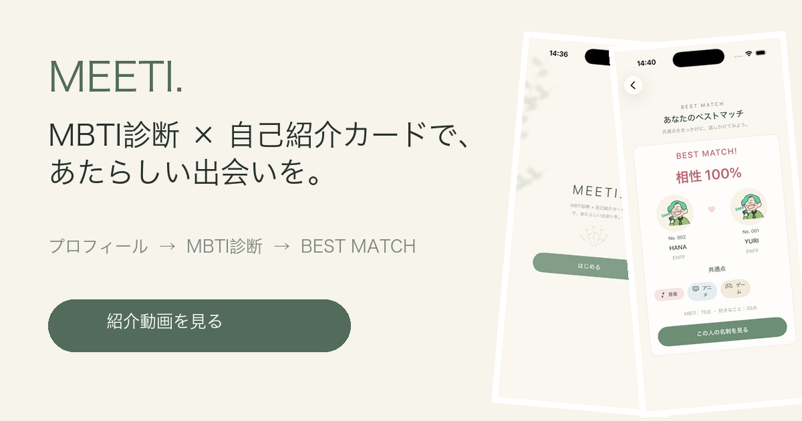

# MEETI

**MBTI診断 × 自己紹介カードで、新しい出会いをつくる文化祭向けiOSアプリです。**

プロフィールと好きなことを登録し、簡易MBTI診断を行うと、自分だけの自己紹介カードを作れます。参加者同士のMBTIと共通の好きなことから相性を計算し、最も相性のよい相手を「BEST MATCH」として表示します。

## 紹介動画

[MEETIの紹介動画を見る](Demo/MEETI紹介動画.mp4)

※ ナレーションはなく、画面上の説明テロップで機能を紹介しています。

## 主な機能

- ニックネーム・好きなこと・ひとことの登録
- プロフィール写真の撮影（任意）
- 12問・2択の簡易MBTI診断
- 16タイプからのMBTI直接選択
- MBTIに合わせた自己紹介カードの作成
- QRコードによる自己紹介カードの共有
- MBTIと好きなことを使った相性計算
- 最も相性のよい参加者を表示するBEST MATCH
- 同率1位や候補者0人への対応

## アプリの流れ

1. プロフィールを入力する
2. 写真を撮影する、または写真なしで進む
3. 12問に回答するか、16タイプからMBTIを選ぶ
4. 自己紹介カードを作成する
5. 過去の参加者と相性を計算する
6. BEST MATCHと共通点を確認する

## 相性の計算

相性は100点満点です。

- MBTI：最大70点
- 好きなこと：共通する項目1つにつき10点、最大30点

好きなことは、音楽・旅行・カフェ・映画・アニメ・スポーツ・読書・ゲーム・ショッピング・アウトドア・グルメ・犬・猫・アートの14項目から3つ選びます。

## 写真について

撮影した写真は自己紹介カードとマッチング結果に表示されます。撮影前に、マッチング相手から見えることと保存場所について注意書きを表示します。

写真データは `Participant.photoData` として、端末内のMEETIアプリ専用のSwiftData領域に保存されます。写真を登録しない場合は、診断したMBTIに対応するAssets画像を表示します。

## 使用技術

- Swift
- SwiftUI
- SwiftData
- UIKit（カメラ撮影）
- XCTest

## 起動方法

1. `MEETI.xcodeproj` をXcodeで開く
2. 実行するiPhoneシミュレーターまたは実機を選ぶ
3. Runボタンを押す

カメラ撮影の確認にはiPhoneまたはiPadの実機が必要です。シミュレーターでは写真なしでアプリの流れを確認できます。

## テスト

MBTI判定、好きなことの選択、相性計算、BEST MATCH、候補者0人、同率1位などのロジックテストを用意しています。
